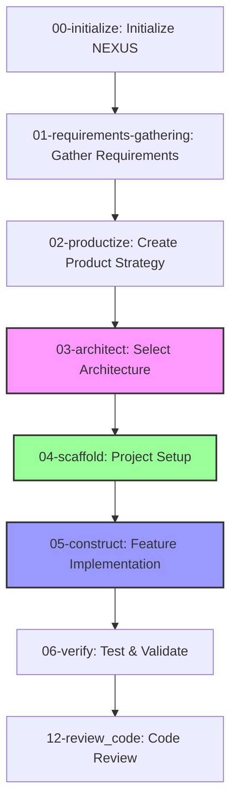

# NEXUS (Polymorphic Reality Implementation System) - Operations Manual

## Command Index

| Command | Name | Purpose | Type |
|---------|------|---------|------|
| 00 | initialize | Initialize NEXUS tracking system | Setup |
| 01 | requirements-gathering | Gather comprehensive system requirements | Interactive |
| 02 | productize | Create prioritized product strategy | Interactive |
| 03 | architect | Select architecture and research versions | Autonomous |
| 04 | scaffold | Implement project setup and structure | Autonomous |
| 05 | construct | Feature implementation with TDD | Autonomous |
| 06 | verify | Test and validate implementations | Autonomous |
| 12 | review_code | Code review and quality analysis | Autonomous |
| 92 | migrate | Version migration | Utility |

## Overview

**NEXUS** is an advanced AI-powered system that manages the complete software development lifecycle from requirements gathering to deployment. It functions as a team of specialized AI agents, each expert in their domain, working together to deliver production-ready software through systematic, best-practice approaches.

## What's New

### Enhanced Prompt Engineering
All NEXUS commands have been enhanced with Anthropic's latest prompt engineering best practices:
- Clear role definitions using natural language
- Step-by-step thinking with XML tags for better reasoning
- Structured output formats for consistency
- Built-in validation and error handling
- Permission to express uncertainty when appropriate

## Prerequisites

NEXUS only requires the `.nexus` directory structure to operate. Project-specific tools are determined during the architecture phase based on requirements.

For the setup phase (03-architect), the generated script will check for required tools based on the chosen architecture.

## Workflow Overview



## Command Structure

NEXUS operates through a series of specialized commands, each handling a specific phase of development:

### Core Development Flow

#### `00-initialize.md`: System Initialization
- **Purpose:** Initialize the NEXUS tracking system
- **Role:** System initialization specialist
- **Creates:** `.nexus` directory structure and configuration files
- **Note:** Does NOT check for development tools - that happens later

#### `01-discover.md`: Requirements Analysis
- **Purpose:** Gather comprehensive system requirements through structured interview
- **Role:** Expert Systems Analyst
- **Creates:** System Requirements Document with user stories, data models, and acceptance criteria
- **Type:** Interactive - requires human input

#### `02-prioritize.md`: Product Backlog Prioritization
- **Purpose:** Transform requirements into prioritized, actionable backlog
- **Role:** Expert Product Owner and Strategic Planner
- **Creates:** Prioritized backlog with MVP definition and roadmap
- **Type:** Interactive - requires human input
- **Special:** Includes technology progression planning

#### `03-architect.md`: Architecture Pattern Selection
- **Purpose:** Select optimal architecture pattern based on requirements
- **Role:** Software Architect (pattern specialist)
- **Creates:** Architecture Decision Record with technology choices and versions
- **Type:** Autonomous - reads requirements and priorities
- **When:** After requirements are clear, BEFORE any setup

#### `03-architect.md`: Project Setup Implementation
- **Purpose:** Implement the selected architecture with setup scripts
- **Role:** DevOps Engineer and Implementation Specialist
- **Creates:** Executable setup script and project structure
- **Type:** Autonomous - reads architecture decision from 025

#### `04-scaffold.md`: Feature Implementation
- **Purpose:** Generate complete, tested code for specific features
- **Role:** Expert Full-Stack Developer
- **Creates:** Implementation package with code, tests, and PR details
- **Type:** Autonomous - requires ticket ID

#### `12-review_code.md`: Code Review & Quality Analysis
- **Purpose:** Review code changes for quality, security, and best practices
- **Role:** Senior Software Engineer (code reviewer)
- **Creates:** Comprehensive code review with actionable feedback
- **Type:** Autonomous - requires branch name

### Utility Commands

#### `90-validate.md`: Requirements Validation
- **Purpose:** Validate requirements for completeness and testability
- **Role:** Requirements Analyst and QA Specialist
- **Creates:** Validation report with issues and recommendations
- **Type:** Autonomous - analyzes requirements document


#### `92-migrate.md`: Version Migration
- **Purpose:** Migrate NEXUS system between versions safely
- **Role:** Software Migration Specialist
- **Creates:** Migration report, backups, and rollback scripts
- **Type:** Autonomous - handles version upgrades

## File Structure

NEXUS uses a structured file system within `.nexus/`:

```
.nexus/
├── NEXUS.json              # System configuration
├── operations.log          # Operation log
├── memories/               # Living documents (current state)
│   ├── _10-REQUIREMENTS.md # Current requirements
│   ├── _20-BACKLOG.md      # Current backlog  
│   ├── _30-ARCHITECTURE.md # Current architecture
│   └── _40-DOCUMENTATION.md # Documentation index
└── history/                # Historical records (snapshots)
    ├── 10-discovery/       # Requirements snapshots
    ├── 20-planning/        # Backlog/planning artifacts
    ├── 30-blueprints/      # Architecture decisions
    └── 40-construction/    # Implementation records
```

## Usage Examples

```bash
# 1. Initialize NEXUS system
# Use 00-initialize.md prompt with Claude
# This creates the .nexus directory structure

# 2. Gather requirements (interactive)
# Use 01-discover.md prompt
# Claude will interview you about your project needs

# 3. Prioritize features (interactive)  
# Use 02-prioritize.md prompt
# Claude will help define MVP and create backlog

# 4. Select architecture pattern
# Use 03-architect.md prompt
# Claude will analyze requirements and select optimal architecture

# 5. Generate setup script
# Use 03-architect.md prompt
# Claude will implement the selected architecture

# 6. Run the generated setup script
./setup.sh my-project-name

# 7. Implement a feature
# Use 04-scaffold.md prompt with ticket ID
# Example: Implement FEAT-001 from backlog

# 8. Review code changes
# Use 12-review_code.md prompt with branch name
# Example: Review feat/FEAT-001-user-auth branch
```