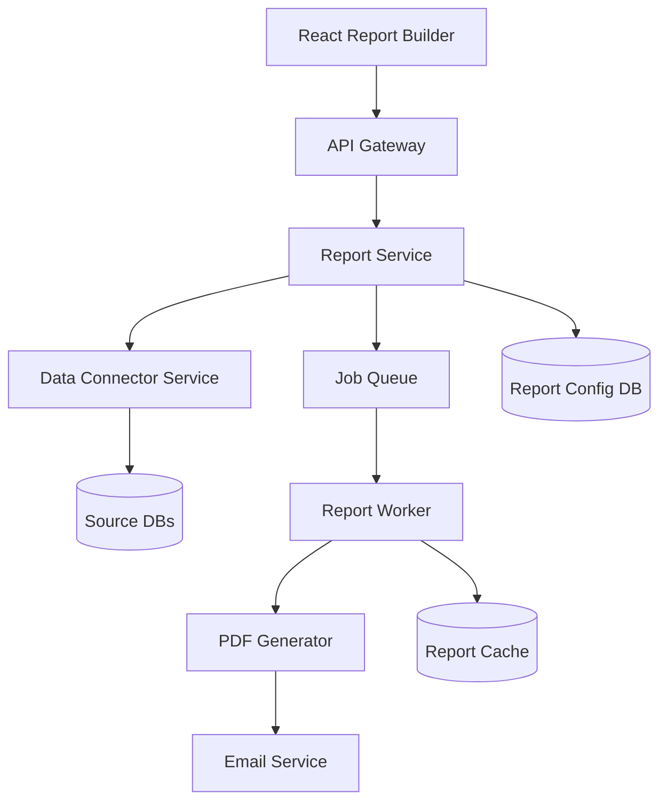

# TDD: [Component/Feature Name]

## AI Assistant Instructions

**Expected Time**: 30-45 minutes for initial draft

### Quick Start
1. Read the PRD first
2. Search for similar existing features (5 min max)
3. Design your solution
4. Fill out sections (skip any marked "if applicable")
5. Mark unknowns clearly - this is expected!

### Key Principles
- **Design thinking > Template completion** - Focus on good architecture
- **Mark unknowns** - Better than guessing
- **Evidence for major decisions only** - Not every choice needs proof
- **Skip irrelevant sections** - Add note why skipped

### When You Don't Know
Use these markers liberally:
- `[TODO: Verify with team]`
- `[ASSUMPTION: X - please confirm]`  
- `[NEEDS INPUT: specific question]`

---

*Note: TDD defines HOW we'll build what the PRD describes. Read the PRD first for context.*

*Example running throughout: Automated Report Builder (matching PRD example)*

## Overview

[1-2 paragraphs: Technical summary of what we're building and key architectural decisions]

Example:
We're building a report generation system that connects to multiple data sources, allows drag-and-drop report building, and automatically runs reports on schedules. The architecture uses a job queue for report generation, a React-based builder UI, and a normalized data layer to handle multiple source formats. Reports are generated server-side as PDFs and distributed via SendGrid.

## Architecture

### High-Level Architecture


### Key Architectural Decisions (2-3 major ones only)

#### Decision: Microservices over Monolith
**Why**: Report generation is CPU-intensive and needs independent scaling
**Trade-off**: More operational complexity
**Alternative**: Monolith modules - rejected due to scaling constraints

#### Decision: Job Queue for Report Generation  
**Why**: Reports can take 30+ seconds, users shouldn't wait
**Trade-off**: Eventually consistent, not real-time
**Alternative**: Synchronous with progress bar - poor mobile experience

*Note: Add evidence for decisions only when it strongly influenced the choice*

### Component Breakdown

| Component | Purpose | Technology | Why This Choice |
|-----------|---------|------------|-----------------|
| [Name] | [What it does] | [Tech stack] | [Reason with evidence] |

Example:
| Component | Purpose | Technology | Why This Choice |
|-----------|---------|------------|-----------------|
| Report Builder UI | Drag-drop interface | React, Redux, DnD Kit | Team standard (see frontend/README.md) |
| API Gateway | Auth, routing, rate limiting | Node.js, Express | Reusing services/gateway/ |
| Report Service | CRUD operations, scheduling | Python, FastAPI | Matches data team stack |
| Data Connector | Source abstraction | Python, SQLAlchemy, pandas | [NEEDS CLARIFICATION: Evaluate Apache Superset?] |
| Job Queue | Async report generation | Redis, BullMQ | Existing queue infra |
| Report Worker | Generate reports | Python, Celery | [REQUIRES TEAM INPUT: Celery vs BullMQ workers?] |
| PDF Generator | Create formatted PDFs | Puppeteer | Reusing services/invoice/pdf/ |

## Integration with Existing Systems

*Quick search (5 min): Look for similar features in services/, lib/, common/*

### Services We'll Reuse
| Service | Purpose | Location |
|---------|---------|----------|
| [Name] | [What we use it for] | [Path or "TODO: Locate"] |

Example:
| Service | Purpose | Location |
|---------|---------|----------|
| Auth Service | User validation | services/auth/ |
| PDF Generator | Report output | [TODO: Verify location] |
| Job Queue | Async processing | lib/queue/ |

### Patterns We're Following
- **API Style**: [REST/GraphQL/gRPC] - matching [which service]
- **Database Naming**: [Pattern observed]
- **Error Handling**: [Pattern observed]

### New vs Existing Components
- ✅ **Reusing**: 
  - PDF generator from services/invoice/pdf/generator.py
  - Job queue infrastructure from lib/queue/
  - [BLOCKED: Need to verify if data connector exists in analytics/]
  
- ❌ **Not Reusing**: 
  - Analytics dashboard (their data model assumes single source)
  - Export service (only handles CSV, we need multiple formats)
  
- 🆕 **Building New**: 
  - Report builder UI (no drag-drop builder exists)
  - Multi-source query engine (current system is single-source)

## Data Model

### Database Schema Design Decisions

#### Decision: Separate reports and report_runs tables
**Why**: Reports are edited frequently, runs are immutable audit records
**Evidence**: 
- Same pattern in services/email/schema.sql (campaigns vs sends)
- Allows indexing runs by status without locking report edits
**Trade-off**: JOINs needed for full history
**Alternative**: Single table with versioning - rejected due to lock contention

#### Decision: JSONB for report configuration  
**Why**: Report structure will evolve rapidly in MVP phase
**Evidence**:
- Feature flags use JSONB successfully (lib/features/models.py)
- PostgreSQL JSONB allows querying unlike text
**Trade-off**: Less type safety, harder migrations
**Migration Plan**: Move to structured columns in v2 once schema stabilizes

### Database Schema
```sql
-- Example core tables
CREATE TABLE reports (
    id UUID PRIMARY KEY,
    name VARCHAR(255),
    owner_id UUID REFERENCES users(id),
    config JSONB, -- Report definition
    schedule JSONB, -- Cron expression, recipients
    created_at TIMESTAMP,
    updated_at TIMESTAMP
);

CREATE TABLE report_runs (
    id UUID PRIMARY KEY,
    report_id UUID REFERENCES reports(id),
    status ENUM('queued', 'running', 'completed', 'failed'),
    started_at TIMESTAMP,
    completed_at TIMESTAMP,
    result_url VARCHAR(500),
    error_message TEXT
);

CREATE TABLE data_sources (
    id UUID PRIMARY KEY,
    type ENUM('postgres', 'mysql', 'sheets'),
    connection_config JSONB, -- Encrypted
    owner_id UUID REFERENCES users(id)
);
```

### Report Config Structure
```json
{
  "version": "1.0",
  "dataSources": ["source-id-1", "source-id-2"],
  "layout": {
    "sections": [{
      "type": "table",
      "dataQuery": "SELECT * FROM orders WHERE date > {startDate}",
      "columns": ["order_id", "customer", "total"],
      "formatting": {...}
    }]
  },
  "parameters": {
    "startDate": "2024-01-01",
    "endDate": "2024-12-31"
  }
}
```

## API Design (if building new API)

### Endpoints Overview
```
POST   /api/v1/reports          # Create report
GET    /api/v1/reports/{id}     # Get report
PUT    /api/v1/reports/{id}     # Update report
DELETE /api/v1/reports/{id}     # Delete report
POST   /api/v1/reports/{id}/run # Run report
```

### Key Design Decisions
- **Style**: REST (matching existing services)
- **Auth**: Bearer tokens via Auth Service
- **Versioning**: URL path versioning (/v1/)
- **IDs**: UUID v4 (security requirement)

*Note: Full OpenAPI spec will be generated during implementation*

### Example Request/Response
```json
// POST /api/v1/reports
{
  "name": "Daily Sales",
  "schedule": "0 9 * * *",
  "config": { /* report definition */ }
}

// Response
{
  "id": "550e8400-e29b-41d4-a716",
  "status": "created",
  "createdAt": "2024-01-15T09:00:00Z"
}
```

## Implementation Plan

### Phase 1: Core Report Engine (Week 1-2)
- [ ] Data source abstraction layer
- [ ] Basic report config schema
- [ ] Simple table/chart generation
- [ ] PDF output

Example tasks:
- Implement PostgreSQL connector with connection pooling
- Create report config validator
- Build basic HTML → PDF pipeline
- Unit tests for data transformation

### Phase 2: Builder UI (Week 3-4)
- [ ] Drag-drop interface
- [ ] Live preview
- [ ] Field selector
- [ ] Save/load reports

Example tasks:
- React component library for report elements
- Redux store for builder state
- Debounced preview API calls
- Accessibility compliance

### Phase 3: Scheduling & Distribution (Week 5-6)
- [ ] Cron job scheduling
- [ ] Email integration
- [ ] Failure handling
- [ ] Status dashboard

Example tasks:
- BullMQ recurring job setup
- SendGrid integration with templates
- Retry logic with exponential backoff
- WebSocket status updates

## Security Considerations (if special requirements)

*Standard security (auth, encryption, etc.) assumed. Only note special concerns:*

Example:
- Reports may contain PII - need audit logging
- Multi-tenant data isolation required
- [ASSUMPTION: Standard auth service handles row-level security]

## Performance Targets (if specific requirements)

*Only document if PRD has specific performance requirements:*

Example:
- Report generation: <5 seconds for 90% of reports
- Concurrent users: Support 100 simultaneous report builders
- [TODO: Verify current system benchmarks]

## Error Handling

### Error Scenarios
| Scenario | User Experience | Technical Handling |
|----------|----------------|-------------------|
| Data source offline | "Using cached data from [time]" | Fallback to cache, alert ops |
| Report generation fails | Email with error + retry button | Exponential backoff, max 3 retries |
| Invalid query | Inline error in builder | Validate against schema |
| Rate limited | "Please wait X seconds" | 429 response with retry-after |

## Monitoring & Testing (Brief)

### Key Metrics to Track
- Report generation time
- Queue depth
- Error rates by type
- [TODO: Set up dashboards during implementation]

### Testing Approach  
- Unit tests for business logic
- Integration tests for API endpoints
- E2E test for critical user flow
- [ASSUMPTION: Following standard test patterns from test/README.md]

## Migration & Rollout

### Feature Flags
```typescript
flags: {
  enableReportBuilder: { default: false, users: ['beta-group'] },
  enableScheduling: { default: false, percentage: 10 },
  maxConcurrentReports: { default: 5, override: { 'enterprise': 20 } }
}
```

### Rollback Plan
- Database migrations are reversible
- Old report system runs in parallel for 30 days
- Export/import tools for report configs
- Circuit breaker for new system → old system

## Dependencies

### External Services
- SendGrid: Email delivery (99.9% SLA)
- AWS S3: Report storage
- Redis Cloud: Caching layer
- Sentry: Error tracking

### Internal Services
- Auth Service: User authentication
- Billing Service: Usage tracking
- Audit Service: Compliance logging

## Quick Validation Checklist (5 items max)

- [ ] **No duplicate functionality exists**
  - Quick search for: [keywords searched]
  - Result: [Found similar in X or "Nothing similar found"]

- [ ] **Follows existing patterns**  
  - API style matches: [which service]
  - Database naming matches: [pattern confirmed]

- [ ] **Security basics covered**
  - Uses standard auth: [Yes/No]
  - Sensitive data handling: [Approach]

- [ ] **Can handle expected load**
  - Expected: [X requests/day]
  - Approach: [Queue/cache/scale strategy]

- [ ] **Key integrations identified**
  - Must integrate with: [List 2-3 services]
  - Risks: [Any concerns]

*Note: Detailed verification happens during implementation, not design*

## Open Questions & Blockers

### Needs Immediate Clarification
1. **Question**: [Specific technical question]
   **Why It Matters**: [Impact on architecture/timeline]
   **Who Can Answer**: [@person]
   **Deadline**: [Date needed by]

Example:
1. **Question**: Should reports support real-time data streaming?
   **Why It Matters**: Affects whether we need WebSockets infrastructure
   **Who Can Answer**: @product-manager
   **Deadline**: Before Phase 2 start

### Assumptions Made (Please Verify)
1. **Assumption**: [What you're assuming]
   **Based On**: [Why you think this]
   **Risk If Wrong**: [What breaks]
   **Verify With**: [@person or team]

Example:
1. **Assumption**: PDF service can handle 50-page reports
   **Based On**: Current invoice max is 10 pages
   **Risk If Wrong**: Need different PDF solution, 2-week delay
   **Verify With**: @pdf-service-team

## Summary

### Design Confidence: [High | Medium | Low]

### Key Decisions Made
1. [Major architecture choice]
2. [Key technology decision]
3. [Important trade-off]

### Still Needs Clarification
1. [Most important unknown]
2. [Second unknown]

### Next Steps
1. [Immediate action needed]
2. [Who to talk to]

*Remember: This is a living document. Update as you learn more.*

---
**Status**: [Draft | In Review | Approved]
**Author**: @engineering-lead
**PRD**: [Link to related PRD]
**Last Updated**: YYYY-MM-DD