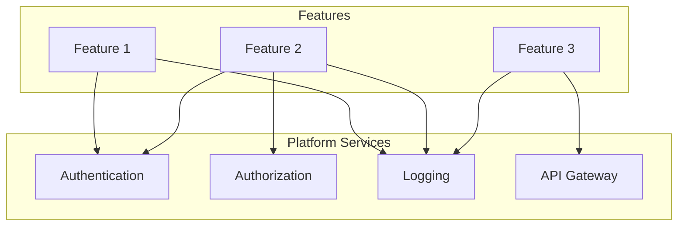

# Platform Services Overview - AI Context

*This document provides an overview of all platform services available for use by features.*

## What Are Platform Services?

Platform services are shared components that provide common functionality across multiple features. They reduce code duplication and ensure consistency.

## Available Services

### Authentication Service
- **Location**: `00-platform/01-authentication/`
- **Purpose**: User authentication, session management, JWT handling
- **Used By**: All features requiring user context
- **Key Operations**: login, logout, validateToken, refreshToken

### Authorization Service  
- **Location**: `00-platform/02-authorization/`
- **Purpose**: Permission checks, role management, access control
- **Used By**: All features with protected resources
- **Key Operations**: checkPermission, getUserRoles, enforcePolicy

### Logging Service
- **Location**: `00-platform/03-logging/`
- **Purpose**: Centralized structured logging, audit trails
- **Used By**: All features
- **Key Operations**: log, audit, query, export

### API Gateway
- **Location**: `00-platform/04-api-gateway/`
- **Purpose**: Request routing, rate limiting, API versioning
- **Used By**: All external-facing APIs
- **Key Operations**: route, rateLimit, version, transform

### UI Component Library
- **Location**: `00-platform/05-ui-components/`
- **Purpose**: Shared React/Vue/Angular components
- **Used By**: All frontend features
- **Key Components**: Button, Form, Table, Modal, Layout

### Data Access Layer
- **Location**: `00-platform/06-data-access/`
- **Purpose**: Database abstraction, query builders, migrations
- **Used By**: All features with data persistence
- **Key Operations**: query, transaction, migrate, seed

### Notification Service
- **Location**: `00-platform/07-notifications/`
- **Purpose**: Email, SMS, push notifications
- **Used By**: Features requiring user notifications
- **Key Operations**: send, schedule, template, track

### File Storage Service
- **Location**: `00-platform/08-file-storage/`
- **Purpose**: File upload, storage, retrieval, CDN integration
- **Used By**: Features handling user uploads
- **Key Operations**: upload, download, delete, generateUrl

## Service Integration Pattern



## How to Add a New Platform Service

1. **Determine if it's truly platform-level**:
   - Used by 3+ features?
   - Provides infrastructure concerns?
   - Enforces system-wide standards?

2. **Create service structure**:
   ```
   00-platform/XX-service-name/
   ├── CLAUDE.md           # AI context (use platform service template)
   ├── README.md           # Human-readable docs
   ├── src/                # Source code
   ├── tests/              # Service tests
   └── decisions/          # Service-specific ADRs
   ```

3. **Document the service**:
   - Fill out CLAUDE.md using platform service template
   - Create integration examples
   - Define SLAs and limits

4. **Update this overview**:
   - Add to Available Services section
   - Update integration diagram if needed

## Platform Standards

All platform services must:
- [ ] Provide language-agnostic interfaces (REST/GraphQL)
- [ ] Include comprehensive error handling
- [ ] Support horizontal scaling
- [ ] Provide health check endpoints
- [ ] Include performance metrics
- [ ] Have 90%+ test coverage
- [ ] Document all breaking changes

## Common Commands

```bash
# Run all platform service tests
npm run test:platform

# Check platform service health
npm run health:platform

# Generate platform service docs
npm run docs:platform

# Lint platform services
npm run lint:platform
```

## Platform ADRs

Key platform-wide decisions:
- [ADR-001-microservices-architecture.md](../01-architecture/ADR-001-microservices-architecture.md)
- [ADR-002-service-communication.md](../01-architecture/ADR-002-service-communication.md)
- [ADR-003-platform-security.md](../01-architecture/ADR-003-platform-security.md)

---
*Last Updated: YYYY-MM-DD*