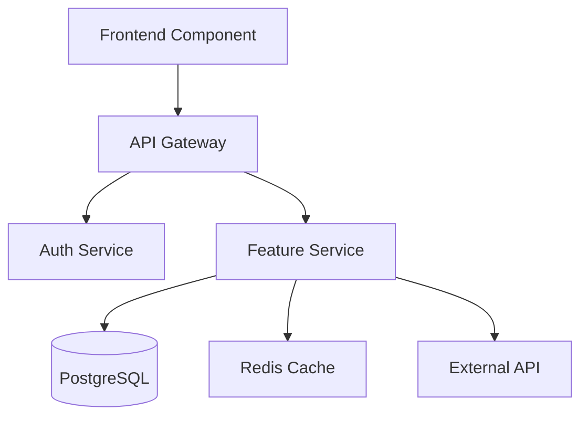
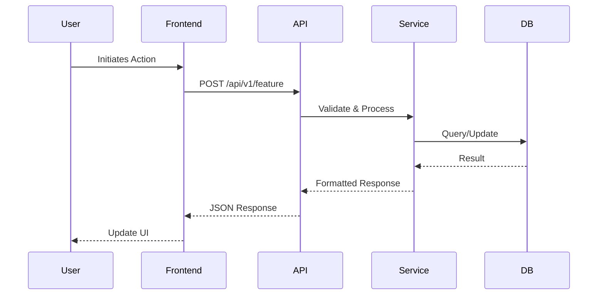

# Feature: [Feature Name] - AI Context

*This document provides context for AI assistants working on this feature. Keep it concise and actionable.*

## Feature Overview
Brief description of what this feature does and its primary purpose.

## Current Status
- **Development Stage**: [Planning | In Progress | Testing | Production | Maintenance]
- **Last Major Update**: YYYY-MM-DD
- **API Version**: [v1 | v2]

## Key Documents
- **Product Requirements**: [PRD-YYYY-MM-description.md](./PRD-YYYY-MM-description.md)
- **Technical Design**: [TDD-YYYY-MM-component.md](./TDD-YYYY-MM-component.md)
- **API Specification**: [Link to OpenAPI/Swagger]
- **Latest ADRs**: 
  - [ADR-001-decision.md](./decisions/ADR-001-decision.md) - Brief description

## Architecture Context

### Component Overview
<!-- When updating architecture, regenerate this diagram with all major components -->


### Data Flow
<!-- Update when request/response flow changes -->


### Key Patterns
- **API Pattern**: RESTful with JWT authentication
- **State Management**: [Redux/Zustand/Context]
- **Error Handling**: Standardized error codes with retry logic
- **Caching Strategy**: Redis with 5-minute TTL for [data type]

## Development Guidelines

### Always
- [ ] Follow [specific pattern] for [use case]
- [ ] Use [specific library/method] for [operation]
- [ ] Check [specific file] before modifying [component]
- [ ] Run [specific test command] after changes

### Never
- [ ] Don't [anti-pattern] - use [correct approach] instead
- [ ] Don't modify [protected component] without updating [dependency]
- [ ] Don't bypass [security measure]

## Code Generation Patterns

### When creating new components
```typescript
// Standard [Component Type] template
export const [ComponentName] = () => {
  // Follow this structure
  const [state, setState] = useState();
  
  useEffect(() => {
    // Effect pattern
  }, []);
  
  return (
    <div>
      {/* Component JSX */}
    </div>
  );
};
```

### When adding API endpoints
```python
# Standard endpoint pattern
@router.post("/feature/{id}")
async def create_feature(
    id: str,
    request: FeatureRequest,
    db: Session = Depends(get_db),
    current_user: User = Depends(get_current_user)
):
    # Validation
    # Business logic
    # Return standardized response
    return {"status": "success", "data": result}
```

## Common Tasks

### Task: Add a new [entity]
1. Create model in `path/to/models/`
   ```python
   # Model template
   class [Entity](BaseModel):
       # fields
   ```
2. Add API endpoint in `path/to/api/`
3. Update tests in `path/to/tests/`
4. Update this diagram if architecture changes

### Task: Modify [workflow]
1. Check current implementation in `path/to/workflow/`
2. Update [specific files]
3. Run integration tests: `npm test:integration` or `pytest tests/integration/`

### Task: Debug [common issue]
1. Check logs: `tail -f logs/app.log` or check CloudWatch
2. Common causes: 
   - [Cause 1]: Check [file/config]
   - [Cause 2]: Verify [condition]
3. Solution pattern: [specific code approach]

## Testing Approach
- **Unit Tests**: `npm test [feature]` or `pytest tests/[feature]/`
- **Integration Tests**: [Command and what to verify]
- **E2E Tests**: [Command and key scenarios]
- **Performance Benchmarks**: [Thresholds and how to run]

## Known Issues & Technical Debt
1. **[Issue Name]**: [Brief description] - See [issue link]
   - Workaround: [temporary solution]
   - Planned fix: [approach or "TBD"]

2. **[Tech Debt Item]**: [What and why]
   - Impact: [current limitations]
   - Refactor plan: [future approach]

## Security Considerations
- **Authentication**: [Method used]
- **Authorization**: Check [permission] before [action]
- **Data Validation**: Always validate [inputs] using [method]
- **Sensitive Data**: [What to protect and how]

## Performance Considerations
- **Caching**: [What's cached and TTL]
- **Rate Limits**: [Endpoints and limits]
- **Optimization**: [Key areas to consider]
- **Monitoring**: Check [dashboard/metric] for issues

## Useful Commands
```bash
# Development
npm run dev:feature     # Start feature in dev mode
npm run build:feature   # Build feature for production

# Testing  
npm test feature.unit   # Run unit tests
npm test feature.e2e    # Run E2E tests
pytest -k feature       # Run Python tests for feature

# Debugging
npm run debug:feature   # Start with debug logging
tail -f logs/feature.log # Watch feature logs

# Database
npm run db:migrate      # Run pending migrations
npm run db:seed:feature # Seed test data
```

## API & Documentation Links
- **API Specification**: [Link to OpenAPI/Swagger spec]
- **GraphQL Schema**: [Link to schema definition]
- **External API Docs**: [Link to integrated service docs]
- **Database Schema**: [Link to ERD or schema docs]

## Document Maintenance

### Update Triggers
- [ ] New API endpoint added
- [ ] Architecture pattern changed (update mermaid diagrams)
- [ ] Performance threshold modified
- [ ] Security requirement updated
- [ ] Major bug discovered with workaround
- [ ] New integration added
- [ ] Breaking change in external dependency

### Auto-Update Checklist
When modifying this feature:
1. Update mermaid diagrams if architecture changed
2. Add new patterns to "Code Generation Patterns"
3. Document any new "Never" rules discovered
4. Update test commands if changed
5. Add new common tasks with examples
6. Update performance/security considerations

---
*Last Updated: YYYY-MM-DD*
*Next Review: YYYY-MM-DD*