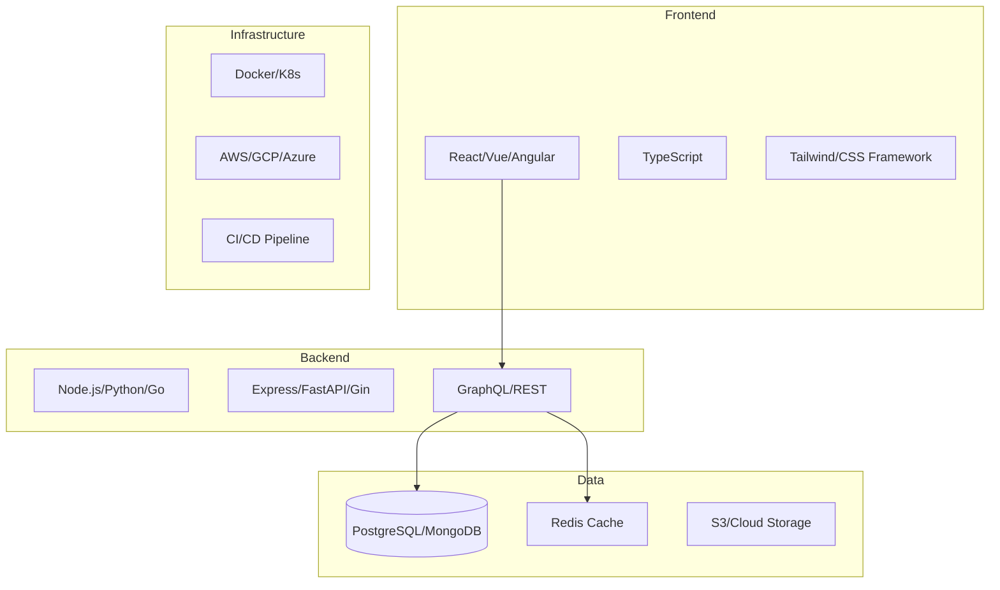

# Platform Service: [Service Name] - AI Context

*This document provides context for AI assistants working with this platform service. Platform services are shared components used by multiple features.*

## Service Overview
Brief description of what this platform service provides and why it exists as a shared component.

## Tech Stack


## Core Architecture Decisions
- **API Strategy**: [REST/GraphQL/Hybrid] - See [ADR-002](../00-platform/01-architecture/ADR-002-api-strategy.md)
- **Database**: [PostgreSQL/MongoDB] - See [ADR-001](../00-platform/01-architecture/ADR-001-database-selection.md)
- **Authentication**: [JWT/OAuth2/Sessions] - See [ADR-003](../00-platform/01-architecture/ADR-003-auth-strategy.md)
- **Deployment**: [Docker/Serverless/VMs] - See [ADR-004](../00-platform/01-architecture/ADR-004-deployment.md)

## Development Standards

### Code Organization
```
src/
├── features/          # Vertical slice architecture
│   └── [feature]/
│       ├── api/       # API endpoints
│       ├── models/    # Data models
│       ├── services/  # Business logic
│       └── tests/     # Feature tests
├── shared/            # Cross-cutting code
│   ├── utils/         # Utility functions
│   ├── middleware/    # Express/FastAPI middleware
│   └── types/         # Shared TypeScript types
└── infrastructure/    # Technical concerns
    ├── database/      # DB connections
    ├── cache/         # Redis setup
    └── monitoring/    # Logging, metrics
```

### Coding Standards
- **Language Style**: [Link to style guide or use Prettier/Black defaults]
- **Naming Conventions**:
  - Files: `kebab-case.ts`
  - Classes: `PascalCase`
  - Functions: `camelCase`
  - Constants: `UPPER_SNAKE_CASE`
  - Database: `snake_case`

### Git Workflow
```bash
# Branch naming
feature/[ticket-id]-description
bugfix/[ticket-id]-description
hotfix/[ticket-id]-description

# Commit format
type(scope): description

# Types: feat, fix, docs, style, refactor, test, chore
# Example: feat(auth): add 2FA support
```

## Common Patterns

### API Endpoint Pattern
```typescript
// GET /api/v1/resource
router.get('/resource', 
  authenticate,
  validate(ResourceSchema),
  async (req, res) => {
    try {
      const result = await service.getResource(req.params);
      res.json({ status: 'success', data: result });
    } catch (error) {
      next(error);
    }
  }
);
```

### Error Handling Pattern
```typescript
// Standardized error response
class AppError extends Error {
  constructor(
    public statusCode: number,
    public message: string,
    public code: string
  ) {
    super(message);
  }
}

// Usage
throw new AppError(400, 'Invalid input', 'VALIDATION_ERROR');
```

### Database Query Pattern
```typescript
// Use query builders or ORMs consistently
const users = await db
  .select('*')
  .from('users')
  .where('active', true)
  .orderBy('created_at', 'desc')
  .limit(10);
```

## Security Guidelines

### Always
- [ ] Validate all inputs using [validation library]
- [ ] Use parameterized queries (never string concatenation)
- [ ] Hash passwords with bcrypt (min 10 rounds)
- [ ] Use HTTPS in production
- [ ] Implement rate limiting on all endpoints
- [ ] Sanitize user-generated content

### Never
- [ ] Log sensitive data (passwords, tokens, PII)
- [ ] Trust client-side validation alone
- [ ] Store secrets in code (use environment variables)
- [ ] Use MD5 or SHA1 for passwords
- [ ] Expose internal error details to users

## Performance Guidelines

### Caching Strategy
```typescript
// Cache key pattern
const cacheKey = `resource:${type}:${id}:${version}`;

// Cache with TTL
await redis.setex(cacheKey, 300, JSON.stringify(data)); // 5 min TTL
```

### Database Optimization
- Create indexes for frequent query patterns
- Use connection pooling (min: 5, max: 20)
- Implement pagination for list endpoints
- Use database views for complex queries

### API Response Times
- Target: < 200ms for simple queries
- Target: < 500ms for complex operations
- Use APM tools to monitor performance

## Testing Standards

### Test Structure
```typescript
describe('Feature Name', () => {
  describe('Component/Function', () => {
    it('should handle specific case', async () => {
      // Arrange
      const input = setupTestData();
      
      // Act
      const result = await functionUnderTest(input);
      
      // Assert
      expect(result).toMatchExpected();
    });
  });
});
```

### Test Coverage Requirements
- Unit Tests: 80% minimum
- Integration Tests: Critical paths
- E2E Tests: User journeys
- Performance Tests: Load scenarios

## Deployment & Infrastructure

### Environment Variables
```bash
# Required in all environments
NODE_ENV=[development|staging|production]
DATABASE_URL=postgresql://...
REDIS_URL=redis://...
JWT_SECRET=...

# Environment-specific
API_URL=https://api.example.com
FRONTEND_URL=https://app.example.com
```

### CI/CD Pipeline
```yaml
# Typical pipeline stages
stages:
  - lint        # Code quality checks
  - test        # Run test suite
  - build       # Build artifacts
  - security    # Security scanning
  - deploy      # Deploy to environment
```

### Monitoring & Logging
```typescript
// Structured logging
logger.info('Operation completed', {
  userId: user.id,
  action: 'resource.create',
  duration: endTime - startTime,
  metadata: { resourceId: resource.id }
});

// Key metrics to track
// - API response times
// - Error rates
// - Database query performance
// - Cache hit rates
```

## Common Commands
```bash
# Development
npm run dev              # Start development server
npm run lint             # Run linting
npm run format           # Auto-format code

# Testing
npm test                 # Run all tests
npm run test:unit        # Unit tests only
npm run test:integration # Integration tests
npm run test:e2e         # End-to-end tests

# Database
npm run db:migrate       # Run migrations
npm run db:seed          # Seed development data
npm run db:reset         # Reset database

# Production
npm run build            # Build for production
npm run start            # Start production server
```

## Useful Resources
- **API Documentation**: [Link to API docs]
- **Architecture Diagrams**: [Link to diagrams]
- **Dependency Docs**: 
  - [Framework documentation]
  - [ORM/Database documentation]
  - [Major library documentation]

## Document Maintenance

### Update Triggers
- [ ] Major dependency version update
- [ ] New architectural pattern adopted
- [ ] Security policy change
- [ ] Performance threshold change
- [ ] New development tool/process
- [ ] Infrastructure change

### Review Schedule
- Monthly: Update commands and dependencies
- Quarterly: Review architectural decisions
- Annually: Full document audit

---
*Last Updated: YYYY-MM-DD*
*Version: 1.0*