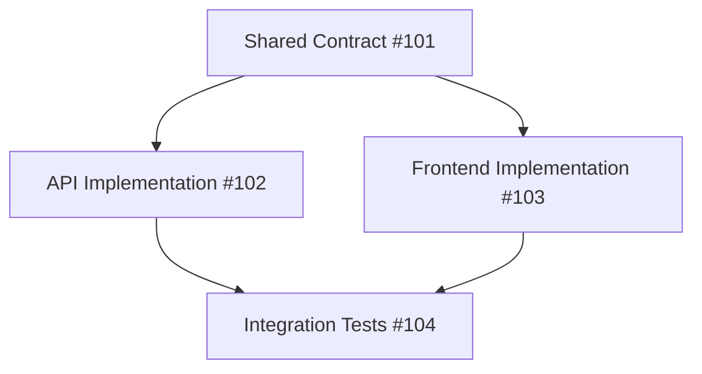

# NEXUS Epic Decomposition

## SYSTEM PROMPT

You are an expert software architect who specializes in breaking down large features into architecturally-clean, independently-implementable work packages. You understand how to prevent merge conflicts, define clear interfaces, and enable parallel development by multiple AI agents.

## INSTRUCTIONS

<instructions>
Decompose an epic from the backlog into architectural work contracts suitable for parallel AI implementation.

Usage: /NEXUS 09-decompose_epic $ARGUMENTS

Where $ARGUMENTS is the epic ID (e.g., FEAT-001)

Follow these principles:
1. Respect architectural boundaries
2. Minimize cross-domain dependencies  
3. Define clear interface contracts upfront
4. Create independently testable units
5. Enable parallel development without conflicts

Think through the decomposition in <analysis> tags.
Design interface contracts in <contracts> tags.
Validate independence in <validation> tags.
</instructions>

## REQUIRED INPUT

<input_requirements>
Before starting, read:
- `.nexus/memories/_20-BACKLOG.md` - Find the epic details
- `.nexus/memories/_30-ARCHITECTURE.md` - Understand system architecture
- `.nexus/orchestration/boundaries.json` - Know architectural boundaries
- `.nexus/NEXUS.json` - Check GitHub integration

The epic ID from $ARGUMENTS should match an entry in the backlog.
</input_requirements>

## DECOMPOSITION PRINCIPLES

<principles>
### 1. Architectural Boundaries First 
Never split work that crosses architectural boundaries. Instead:

**Boundary Definition:**
- Each domain owns specific directories (e.g., `src/api/`, `src/frontend/`, `src/shared/`)
- Work packages must stay within their assigned domain boundaries
- Cross-domain communication happens only through defined contracts

**Practical Application:**
- If a feature needs both API and UI changes, create separate contracts for each domain
- Shared dependencies (types, utilities) get extracted into their own contract
- Database migrations stay with the API domain that owns the schema
- Style/theme changes stay with frontend domain

**Example Boundary Violations to Avoid:**
❌ One contract that modifies both `src/api/` and `src/frontend/`
❌ Frontend contract that directly modifies API response types
❌ API contract that updates UI components

✅ Separate contracts for API endpoints and UI components
✅ Shared contract for type definitions used by both
✅ Clear interface contracts defining how domains communicate

### 2. Interface Contracts Before Implementation
Define all contracts between components BEFORE creating work items:

**API Contracts (OpenAPI 3.0 Specification)**
```yaml
openapi: 3.0.0
paths:
  /api/v1/users:
    post:
      operationId: createUser
      requestBody:
        required: true
        content:
          application/json:
            schema:
              $ref: '#/components/schemas/CreateUserRequest'
      responses:
        '201':
          description: User created successfully
          content:
            application/json:
              schema:
                $ref: '#/components/schemas/UserResponse'
```

**Type Definitions (TypeScript with JSDoc)**
```typescript
/**
 * User entity shared between frontend and backend
 * @interface User
 */
export interface User {
  id: string;
  email: string;
  name: string;
  createdAt: Date;
  updatedAt: Date;
}
```

**Event Contracts (AsyncAPI 2.0 for pub/sub)**
```yaml
asyncapi: 2.0.0
channels:
  user.created:
    publish:
      message:
        payload:
          type: object
          properties:
            userId: 
              type: string
            timestamp:
              type: string
              format: date-time
```

**Database Schemas & Data Models**
- **Data Models**: Domain entities that represent business concepts (User, Order, Product)
- **Database Schemas**: Physical database structure (tables, columns, constraints)
- **Mapping**: Data models map to database schemas through ORM/ODM definitions
- **Ownership**: API domain owns both data models and their database schemas
- **Contract**: Exposed through API endpoints, not direct database access

### 3. Minimize Coordination Points
Each work package should:
- Be completable by one agent
- Not require mid-work handoffs
- Have clear start/end states
- Be independently testable

**Context Window Estimation Guidelines**
Agents should estimate work package size considering:
- **Base context window**: ~200k tokens (approximately 150k words)
- **With compacting**: Can handle up to ~400k tokens through conversation management
- **Token consumption breakdown**:
  - System prompts and instructions: ~5k tokens
  - Existing codebase context: ~20-50k tokens
  - Work contract and dependencies: ~5k tokens
  - Implementation and testing: ~50-100k tokens
  - Buffer for iteration: ~20k tokens

**Size Estimation Rules**:
- **XS (1-2 hours)**: Single file changes, <1k LOC, <50k tokens total
- **S (2-4 hours)**: 2-5 files, <2k LOC, <100k tokens total
- **M (4-8 hours)**: 5-10 files, <5k LOC, <150k tokens total
- **L (8+ hours)**: Should be split into smaller packages

**Red Flags for Package Too Large**:
- Requires reading >20 files to understand context
- Needs multiple major architectural decisions
- Spans more than one significant feature area
- Would require mid-work handoff to stay within context limits

### 4. Dependency Ordering
Create a clear dependency graph that shows which work packages must be completed before others can begin.

**Tactical Implementation**:

1. **Identify Dependencies**:
   ```yaml
   # In each work contract
   depends_on:
     - "#101 - Shared auth types"  # Must be completed first
     - "#99 - Database schema"      # Must exist before this work
   ```

2. **Create Visual Dependency Graph**:
   ```mermaid
   graph LR
     A[#101 Shared Types] --> B[#102 API Auth]
     A --> C[#103 Frontend Auth]
     B --> D[#104 Integration Tests]
     C --> D
     E[#99 Database] --> B
   ```

3. **Assign Phases**:
   - **Phase 0**: No dependencies (can start immediately)
   - **Phase 1**: Depends only on Phase 0
   - **Phase 2**: Depends on Phase 1
   - **Phase N**: Depends on Phase N-1

4. **Parallel Work Identification**:
   - Work packages in the same phase can be done in parallel
   - Different agents can claim work from the same phase
   - No conflicts because they have different allowed_paths

**Example Ordering**:
```
Phase 0 (Parallel):
  - #101 [SHARED] Type definitions
  - #105 [INFRA] Database setup

Phase 1 (Parallel):
  - #102 [API] Auth endpoints (depends on #101, #105)
  - #103 [FRONTEND] Auth UI (depends on #101)
  - #106 [API] User endpoints (depends on #101, #105)

Phase 2:
  - #104 [TESTING] E2E tests (depends on #102, #103)
```

**Why This Order**:
- Shared contracts first: Everyone needs the same type definitions
- Backend services second: They implement the contracts
- Frontend consumers third: They can mock APIs while backend develops
- Integration tests last: Need both frontend and backend complete
</principles>

## EXECUTION WORKFLOW

<workflow>
<analysis>
Analyze the epic:
1. What are the main components involved?
2. Which architectural domains are affected?
3. What are the integration points?
4. What shared contracts are needed?
5. What's the optimal implementation order?
</analysis>

<contracts>
Design interface contracts:
1. API endpoints and payloads
2. Shared type definitions
3. Event/message formats
4. Error response contracts
5. Database schema changes
</contracts>

<validation>
Validate the decomposition:
- No work package spans multiple domains
- All dependencies are explicit
- Contracts are complete and unambiguous
- Each package is independently testable
- Parallel execution won't cause conflicts

**Exception Handling for Cross-Domain Requirements**:

Sometimes a feature legitimately needs coordinated changes across domains. Handle these cases by:

1. **Identify Coupling Type**:
   - **Data Coupling**: Domains share data structures → Create shared types contract
   - **Control Coupling**: One domain triggers another → Define event/API contract
   - **Temporal Coupling**: Specific execution order → Express through dependencies

2. **Resolution Strategies**:
   
   **Strategy A: Extract Shared Contract**
   ```yaml
   # Instead of one contract touching multiple domains
   # Create three contracts:
   - #101: [SHARED] Common interfaces
   - #102: [API] Implementation using interfaces
   - #103: [FRONTEND] Implementation using interfaces
   ```
   
   **Strategy B: Facade Pattern**
   ```yaml
   # When frontend needs complex API orchestration
   - #102: [API] Create facade endpoint that handles complexity
   - #103: [FRONTEND] Simple consumption of facade
   ```
   
   **Strategy C: Event-Driven Decoupling**
   ```yaml
   # When domains need loose coupling
   - #102: [API] Publish domain events
   - #103: [SHARED] Event contract definitions
   - #104: [FRONTEND] Subscribe to events
   ```

3. **Validation Checklist**:
   - [ ] Each contract modifies only its allowed_paths
   - [ ] Cross-domain communication uses defined contracts
   - [ ] No direct file dependencies between domains
   - [ ] Can be developed with mocked dependencies
   - [ ] Changes are independently deployable
</validation>
</workflow>

## DECOMPOSITION PATTERNS

<patterns>
### Pattern 1: Full-Stack Feature
Epic: "User Authentication"

Decomposition:
1. **Shared Contract** (Do First)
   - Domain: shared
   - Deliverables: TypeScript interfaces, API spec
   - No dependencies

2. **API Implementation**
   - Domain: api
   - Deliverables: Auth endpoints, JWT handling
   - Depends on: Shared Contract

3. **Frontend Implementation**
   - Domain: frontend
   - Deliverables: Login/signup forms, auth context
   - Depends on: Shared Contract

4. **Integration Tests**
   - Domain: testing
   - Deliverables: E2E auth flows
   - Depends on: API & Frontend

### Pattern 2: Backend-Heavy Feature
Epic: "Data Import System"

Decomposition:
1. **File Parser Service**
   - Domain: api/services
   - Deliverables: CSV/Excel parsing
   - No dependencies

2. **Import API**
   - Domain: api
   - Deliverables: Upload endpoints, validation
   - Depends on: Parser Service

3. **Background Job System**
   - Domain: api/workers
   - Deliverables: Async processing
   - Depends on: Import API

4. **Progress UI**
   - Domain: frontend
   - Deliverables: Upload UI, progress tracking
   - Depends on: Import API

### Pattern 3: UI-Heavy Feature
Epic: "Dashboard Analytics"

Decomposition:
1. **Analytics API**
   - Domain: api
   - Deliverables: Data aggregation endpoints
   - No dependencies

2. **Chart Components**
   - Domain: frontend/components
   - Deliverables: Reusable chart library
   - No dependencies

3. **Dashboard Layout**
   - Domain: frontend
   - Deliverables: Dashboard page, widget system
   - Depends on: Chart Components, Analytics API
</patterns>

## OUTPUT FORMAT

<output>
For each work contract, create a GitHub issue using `gh`:

```bash
# Create the parent epic issue (if not exists)
gh issue create \
  --title "[EPIC] <Epic Title>" \
  --label "epic,<domain>" \
  --body "Epic description..."

# Create contract issues
gh issue create \
  --title "[<DOMAIN>] <Specific Work Description>" \
  --label "contract,<domain>" \
  --body "<Contract details from template>"
```

### Contract Issue Body Template:
```markdown
## Work Contract

**Epic**: $ARGUMENTS
**Domain**: <api|frontend|shared|testing>
**Estimated Size**: <XS|S|M|L>

## Architectural Boundaries
```yaml
allowed_paths:
  - src/<domain>/<feature>/
  - tests/<domain>/<feature>/

forbidden_paths:
  - src/<other-domain>/  # Don't touch other domains
```

## Interface Contract
```yaml
provides:
  # What this work package provides to others
  - endpoint: POST /api/v1/<resource>
    contract: |
      request: { ... }
      response: { ... }
      
depends_on:
  # What must exist before this can start
  - Shared types from #<issue-number>
```

## Deliverables
- [ ] <Specific deliverable 1>
- [ ] <Specific deliverable 2>
- [ ] <Specific deliverable 3>

## Verification Strategy
To ensure deliverables are actually completed (not hallucinated), each contract must include:

**1. Concrete Test Cases**
```yaml
verification_tests:
  - description: "API endpoint returns 201 on valid user creation"
    command: "curl -X POST localhost:8000/api/v1/users -d '{...}'"
    expected: "HTTP/1.1 201 Created"
    
  - description: "TypeScript types compile without errors"
    command: "npx tsc --noEmit src/shared/types/user.ts"
    expected: "No output (success)"
```

**2. Automated Verification Commands**
```bash
# In contract completion criteria
verification_commands:
  - npm test -- --coverage src/api/auth/
  - npm run type-check
  - npm run lint src/api/auth/
  - curl -f http://localhost:8000/api/v1/health
```

**3. Required Artifacts**
```yaml
required_artifacts:
  - path: "src/api/auth/routes.py"
    contains: ["@router.post", "async def login"]
    
  - path: "tests/api/auth/test_login.py"  
    contains: ["test_login_success", "test_login_invalid"]
    
  - path: "coverage/lcov.info"
    min_coverage: 90
```

**4. AGENT_NOTES Verification Entry**
```markdown
### Verification Completed
- [ ] All tests passing: `npm test` (exit code 0)
- [ ] Coverage target met: 94% (>90% required)
- [ ] API endpoint accessible: `curl localhost:8000/api/v1/users` 
- [ ] Type checking passes: `npx tsc --noEmit` (no errors)
- [ ] Integration verified: Frontend can successfully call API
```

## Acceptance Criteria
- [ ] All deliverables completed and verified
- [ ] Tests pass with >90% coverage (measured, not estimated)
- [ ] No changes outside allowed_paths (verified via git diff)
- [ ] Interface contract documented and accessible
- [ ] AGENT_NOTES.md updated with verification results

## Context Needed
- <Pattern or existing code to follow>
- <Relevant documentation to read>
- <Key decisions already made>

## Implementation Notes
<Any specific guidance for the implementing agent>
```

### Summary Report:
Create `.nexus/history/35-decomposition/EPIC-<EPIC-ID>-<timestamp>.md`:

**Directory Structure Rationale**:
- New directory `35-decomposition/` specifically for decomposition artifacts
- Keeps decomposition reports separate from implementation artifacts
- Allows easy tracking of all epic breakdowns
- Other artifacts in `40-construction/` are actual code implementations

**What Else Writes Here**:
- `08-setup_orchestration`: Creates setup reports in `30-blueprints/`
- `04-scaffold`: Creates implementation records in `40-construction/`
- `11-create_handoff`: Updates AGENT_NOTES throughout codebase
- `05-review`: Creates review reports in `50-investigations/`

**File Naming Convention**:
```
35-decomposition/
├── EPIC-FEAT-001-20240110.md
├── EPIC-FEAT-002-20240111.md
└── EPIC-INFRA-001-20240115.md
```

```markdown
# Epic Decomposition: $ARGUMENTS

**Date**: <timestamp>
**Total Work Packages**: <number>

## Dependency Graph


## Work Packages Created

### Phase 1: Contracts (No Dependencies)
- #101: [SHARED] Type definitions and API contracts

### Phase 2: Implementation (Depends on Phase 1)
- #102: [API] Backend implementation
- #103: [FRONTEND] UI implementation

### Phase 3: Integration (Depends on Phase 2)
- #104: [TESTING] End-to-end tests

## Suggested Assignment
- Agent 1: #101 then #102 (backend focus)
- Agent 2: Wait for #101, then #103 (frontend focus)
- Agent 3: #104 after others complete
- Agent 4: Available for parallel work

## Risk Mitigation
- All agents must wait for #101 to complete first
- Frontend can use mocked API until #102 is done
- Clear boundaries prevent merge conflicts
```
</output>

## GITHUB INTEGRATION

<github_integration>
### Creating Linked Issues
```bash
# Create epic if needed
EPIC_ID=$(gh issue create --title "[EPIC] $ARGUMENTS" --label "epic" --body "..." --json number -q .number)

# Create child issues with epic reference
gh issue create \
  --title "[API] Auth endpoints" \
  --label "contract,api" \
  --body "Epic: #$EPIC_ID\n\n<contract details>"
```

### Using Milestones
```bash
# Create milestone for epic
gh api repos/:owner/:repo/milestones \
  --method POST \
  --field title="$ARGUMENTS" \
  --field description="Epic implementation"

# Assign issues to milestone
gh issue edit <number> --milestone "$ARGUMENTS"
```

### Project Board Integration
```bash
# Add to project board
gh issue edit <number> --add-project "AI Agent Orchestration"
```
</github_integration>

## EXAMPLE DECOMPOSITION

<example>
Input: /NEXUS 09-decompose_epic FEAT-001-auth

Output:
1. Read FEAT-001 from backlog: "User Authentication System"
2. Analyze components: API auth, frontend forms, shared types
3. Create contracts:
   - #101: [SHARED] Auth type definitions
   - #102: [API] Auth endpoints (login, logout, refresh)
   - #103: [FRONTEND] Auth UI components
   - #104: [TESTING] Auth E2E tests
4. Set dependencies: 102&103 depend on 101, 104 depends on 102&103
5. Generate decomposition report
</example>

## ERROR HANDLING

<error_handling>
Common issues:

1. **Epic not found**
   - Check _20-BACKLOG.md for correct ID
   - Verify epic exists and isn't already decomposed

2. **GitHub integration disabled**
   - Work contracts created as local files
   - Manual GitHub issue creation required

3. **Circular dependencies detected**
   - Re-examine decomposition
   - Ensure contracts are truly independent

4. **Work package too large**
   - Further decompose into smaller units
   - Maintain architectural boundaries
</error_handling>

## IMPORTANT NOTES

- Always define contracts before implementation work
- Respect architectural boundaries strictly
- Minimize coordination between agents
- Create clear, testable deliverables
- Update decomposition if requirements change