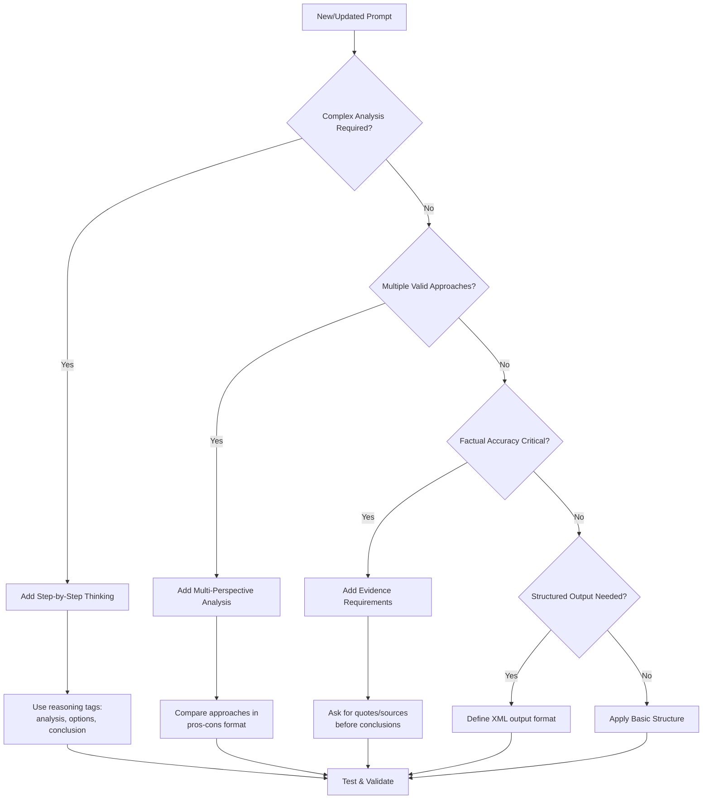

# NEXUS Prompt Engineering Optimization Command

**Command ID**: 90-improve-prompts  
**Purpose**: Systematically review and enhance NEXUS command prompts using Anthropic best practices  
**Based on**: Anthropic Prompt Engineering Interactive Tutorial Analysis

## EXECUTIVE SUMMARY

This command applies proven prompt engineering techniques to optimize NEXUS system prompts for accuracy, consistency, and effectiveness. It provides a systematic approach to reviewing and improving all NEXUS commands, living documents, and AI-powered features.

## CORE PRINCIPLES (80/20 RULE)

### 🎯 **TOP 5 HIGH-IMPACT TECHNIQUES**

1. **Separate Data from Instructions** (Chapter 4)

   - Place instructions BEFORE data
   - Use clear delimiters: `<data>`, `<instructions>`, `<context>`
   - Never mix commands with variable content

2. **Enable Step-by-Step Thinking** (Chapter 6)

   - Add "First, think through this step by step in <thinking> tags"
   - Use reasoning tags: `<analysis>`, `<reasoning>`, `<conclusion>`
   - Allow Claude to "think out loud" before answering

3. **Provide Clear Examples** (Chapter 7)

   - Include 1-3 concrete examples for complex tasks
   - Use consistent formatting across examples
   - Show both input and expected output format

4. **Avoid Hallucinations** (Chapter 8)

   - Give Claude permission to say "I don't know"
   - Ask for evidence before conclusions
   - Use "Only answer if you're certain" phrasing

5. **Structure Output Consistently** (Chapter 5)
   - Use XML tags for structured output: `<answer>`, `<summary>`, `<action_items>`
   - Specify exact format requirements
   - Use prefilling to start responses in correct format

## PROMPT OPTIMIZATION CHECKLIST

### ✅ **STRUCTURE REVIEW**

- [ ] Instructions come before data/context
- [ ] Clear role definition in system prompt
- [ ] Specific task description with success criteria
- [ ] Output format explicitly specified
- [ ] Examples provided for complex tasks

### ✅ **CLARITY ENHANCEMENT**

- [ ] Direct, specific language (avoid "please" and hedging)
- [ ] One clear task per prompt
- [ ] Unambiguous success criteria
- [ ] Concrete examples over abstract descriptions
- [ ] Consistent terminology throughout

### ✅ **REASONING OPTIMIZATION**

- [ ] Step-by-step thinking enabled with tags
- [ ] Evidence gathering before conclusions
- [ ] Multiple perspective analysis for complex decisions
- [ ] Validation steps included
- [ ] "Think then answer" structure

### ✅ **ACCURACY SAFEGUARDS**

- [ ] Permission to express uncertainty
- [ ] Request for evidence/quotes from source material
- [ ] Validation against provided criteria
- [ ] Error checking mechanisms
- [ ] Fallback options for edge cases

### ✅ **OUTPUT CONSISTENCY**

- [ ] XML tags for structured sections
- [ ] Consistent formatting across similar commands
- [ ] Clear delimiters between sections
- [ ] Standardized success/failure indicators
- [ ] Predictable response structure

## DECISION TREE: WHEN TO USE ADVANCED TECHNIQUES



## BEFORE/AFTER EXAMPLES

### ❌ **BEFORE: Basic Command**

```
Analyze the requirements and create a backlog.
```

### ✅ **AFTER: Optimized Command**

```
You are a product management expert specializing in software requirements analysis.

<instructions>
Analyze the provided requirements and create a prioritized product backlog. Follow these steps:

1. First, extract key features in <analysis> tags
2. Then, prioritize by business value and complexity in <prioritization> tags
3. Finally, format as a backlog in <backlog> tags

Use this format for each backlog item:
- **[Priority]** Feature Name: Description (Effort: X points)
</instructions>

<requirements>
{requirements_content}
</requirements>

Think through this step by step, then provide your analysis.
```

### ❌ **BEFORE: Vague Validation**

```
Review the code and tell me if it's good.
```

### ✅ **AFTER: Structured Review**

```
You are a senior software engineer conducting a code review.

<instructions>
Review the provided code against these criteria. For each criterion, provide evidence from the code:

1. **Functionality**: Does it meet requirements?
2. **Code Quality**: Is it readable and maintainable?
3. **Security**: Are there any security concerns?
4. **Performance**: Any performance issues?

Format your response as:
<review>
<criterion name="functionality">
<assessment>Pass/Fail/Needs Work</assessment>
<evidence>Specific code examples</evidence>
<recommendations>Specific improvements</recommendations>
</criterion>
[Repeat for each criterion]
</review>

Only mark as "Pass" if you're certain it meets the standard. If unsure, mark as "Needs Work" and explain what additional information you need.
</instructions>

<code>
{code_content}
</code>

First analyze each criterion in <thinking> tags, then provide your structured review.
```

## ADVANCED TECHNIQUES

### 🔗 **PROMPT CHAINING** (Chapter 10.1)

**When to Use**: Multi-step processes, validation workflows, iterative refinement

**Pattern**:

```
Step 1: Initial Analysis → Store Result
Step 2: Validation → Use Previous Result
Step 3: Final Output → Combine All Results
```

**NEXUS Application**:

- Requirements → Architecture → Implementation Plan
- Code Review → Fix Recommendations → Validation
- Analysis → Options → Decision → Action Plan

### 🛠️ **TOOL USE INTEGRATION** (Chapter 10.2)

**When to Use**: External data needed, calculations required, file operations

**System Prompt Template**:

```
You have access to tools for [specific domain]. Use tools when:
- Calculations are needed
- External data must be retrieved
- File operations are required

<function_calls>
<invoke name="tool_name">
<parameter name="param">value</parameter>
</invoke>
</function_calls>
```

**NEXUS Integration Points**:

- Financial analysis calculations
- Git operations and code analysis
- File system operations
- API calls for external data

### 📊 **MULTI-SHOT EXAMPLES** (Chapter 7)

**When to Use**: Complex formatting, domain-specific tasks, consistent style

**Structure**:

```
Here are examples of the expected format:

Example 1:
Input: [specific input]
Output: [exact expected format]

Example 2:
Input: [different input type]
Output: [same format, different content]

Now process: [actual input]
```

### 🎯 **CONTEXT PRIMING**

**Order of Information**:

1. **Role Definition** (Who Claude is)
2. **Task Description** (What to do)
3. **Success Criteria** (How to measure success)
4. **Examples** (What good looks like)
5. **Data/Context** (What to work with)
6. **Output Format** (How to respond)

## IMPLEMENTATION WORKFLOW

### 📋 **PHASE 1: AUDIT EXISTING PROMPTS**

```bash
# Run this analysis on each NEXUS command
1. Identify prompt structure issues
2. Check for missing examples
3. Validate output consistency
4. Test edge cases
5. Document improvement opportunities
```

### 🔧 **PHASE 2: APPLY OPTIMIZATIONS**

```bash
# For each command file:
1. Add role definition to system prompt
2. Restructure: instructions → examples → data
3. Add step-by-step thinking tags
4. Include validation mechanisms
5. Standardize output format
```

### ✅ **PHASE 3: VALIDATE IMPROVEMENTS**

```bash
# Test each optimized prompt:
1. Run with typical inputs
2. Test edge cases
3. Verify output consistency
4. Check reasoning quality
5. Measure accuracy improvement
```

## QUICK REFERENCE CARDS

### 🚀 **INSTANT IMPROVEMENTS**

- Add "Think step by step in <thinking> tags"
- Use XML tags for all structured output
- Put instructions before data
- Include 1-2 concrete examples
- Give permission to say "I don't know"

### ⚠️ **COMMON PITFALLS TO AVOID**

- Mixing instructions with variable data
- Vague success criteria
- No examples for complex tasks
- Forcing answers when uncertain
- Inconsistent output formatting

### 🎯 **POWER PATTERNS**

```
Role + Task + Think + Format + Validate
System: "You are [role]"
User: "Do [task]. First think in <thinking> tags. Format as [structure]. Only proceed if certain."
```

## EXECUTION COMMAND

To apply this guide to existing NEXUS commands:

```bash
# Review and optimize all NEXUS commands
find .claude/commands/NEXUS -name "*.md" -exec echo "Reviewing: {}" \; -exec cat {} \;

# Apply optimization checklist to each command
# Update prompts following the patterns above
# Test with sample inputs
# Document improvements in changelog
```

**Next Steps**:

1. Review current NEXUS command prompts against this checklist
2. Prioritize high-impact improvements (80/20 rule)
3. Implement optimizations incrementally
4. Test and validate each change
5. Update this guide based on results
