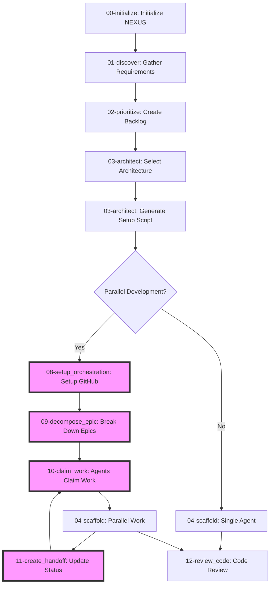
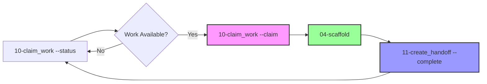

# NEXUS (Polymorphic Reality Implementation System) - Operations Manual

## Command Index

| Command | Name | Purpose | Type |
|---------|------|---------|------|
| 00 | initialize | Initialize NEXUS tracking system | Setup |
| 01 | discover | Gather comprehensive system requirements | Interactive |
| 02 | prioritize | Create prioritized product backlog | Interactive |
| 03 | architect | Generate project setup script | Autonomous |
| 04 | scaffold | Implement features with tests | Autonomous |
| 05 | construct | Feature implementation with TDD | Autonomous |
| 06 | verify | Test and validate implementations | Autonomous |
| 07 | refine | Code review and quality analysis | Autonomous |
| 08 | setup_orchestration | Setup parallel AI coordination | Autonomous |
| 09 | decompose_epic | Break epics into work contracts | Autonomous |
| 10 | claim_work | Claim and execute work contracts | Autonomous |
| 11 | create_handoff | Documentation generation | Autonomous |
| 12 | review_code | Multi-modal review (code, docs, PRs) | Autonomous |
| 90 | validate | Requirements validation | Utility |
| 91 | optimize | Performance optimization | Utility |
| 92 | migrate | Version migration | Utility |
| 93 | spawn_parallel | Direct parallel agent spawning | Utility |
| 98 | patterns | Pattern library management | Utility |

## Overview

**NEXUS** is an advanced AI-powered system that manages the complete software development lifecycle from requirements gathering to deployment. It functions as a team of specialized AI agents, each expert in their domain, working together to deliver production-ready software through systematic, best-practice approaches.

## What's New

### Parallel AI Agent Development (NEW!)
NEXUS now supports orchestrated parallel development with multiple AI agents working simultaneously:
- **Agent Orchestration**: Multiple Claude Code instances working in parallel
- **Architectural Boundaries**: Prevents merge conflicts through clear work contracts
- **Smart Coordination**: Agents communicate through AGENT_NOTES.md files
- **GitHub Integration**: Work tracked through issues with contract labels

### Enhanced Prompt Engineering
All NEXUS commands have been enhanced with Anthropic's latest prompt engineering best practices:
- Clear role definitions using natural language
- Step-by-step thinking with XML tags for better reasoning
- Structured output formats for consistency
- Built-in validation and error handling
- Permission to express uncertainty when appropriate

## Prerequisites

NEXUS only requires the `.nexus` directory structure to operate. Project-specific tools are determined during the architecture phase based on requirements.

For the setup phase (03-architect), the generated script will check for required tools based on the chosen architecture.

## Workflow Overview



## Command Structure

NEXUS operates through a series of specialized commands, each handling a specific phase of development:

### Core Development Flow

#### `00-initialize.md`: System Initialization
- **Purpose:** Initialize the NEXUS tracking system
- **Role:** System initialization specialist
- **Creates:** `.nexus` directory structure and configuration files
- **Note:** Does NOT check for development tools - that happens later

#### `01-discover.md`: Requirements Analysis
- **Purpose:** Gather comprehensive system requirements through structured interview
- **Role:** Expert Systems Analyst
- **Creates:** System Requirements Document with user stories, data models, and acceptance criteria
- **Type:** Interactive - requires human input

#### `02-prioritize.md`: Product Backlog Prioritization
- **Purpose:** Transform requirements into prioritized, actionable backlog
- **Role:** Expert Product Owner and Strategic Planner
- **Creates:** Prioritized backlog with MVP definition and roadmap
- **Type:** Interactive - requires human input
- **Special:** Includes technology progression planning

#### `03-architect.md`: Architecture Pattern Selection
- **Purpose:** Select optimal architecture pattern based on requirements
- **Role:** Software Architect (pattern specialist)
- **Creates:** Architecture Decision Record with technology choices and versions
- **Type:** Autonomous - reads requirements and priorities
- **When:** After requirements are clear, BEFORE any setup

#### `03-architect.md`: Project Setup Implementation
- **Purpose:** Implement the selected architecture with setup scripts
- **Role:** DevOps Engineer and Implementation Specialist
- **Creates:** Executable setup script and project structure
- **Type:** Autonomous - reads architecture decision from 025

#### `04-scaffold.md`: Feature Implementation
- **Purpose:** Generate complete, tested code for specific features
- **Role:** Expert Full-Stack Developer
- **Creates:** Implementation package with code, tests, and PR details
- **Type:** Autonomous - requires ticket ID

#### `12-review_code.md`: Code Review & Quality Analysis
- **Purpose:** Review code changes for quality, security, and best practices
- **Role:** Senior Software Engineer (code reviewer)
- **Creates:** Comprehensive code review with actionable feedback
- **Type:** Autonomous - requires branch name

### Parallel Development Commands (NEW!)

#### `08-setup_orchestration.md`: Agent Orchestration Setup
- **Purpose:** Set up GitHub infrastructure for parallel AI development
- **Role:** AI Development Orchestration Specialist
- **Creates:** Labels, issue templates, project boards, and coordination structure
- **Type:** Autonomous - run once per project
- **Usage:** `/NEXUS 08-setup_orchestration setup`

#### `09-decompose_epic.md`: Epic Decomposition
- **Purpose:** Break down epics into architecturally-clean work contracts
- **Role:** Expert Software Architect (decomposition specialist)
- **Creates:** GitHub issues with clear boundaries and interface contracts
- **Type:** Autonomous - requires epic ID
- **Usage:** `/NEXUS 09-decompose_epic FEAT-001`

#### `10-claim_work.md`: Agent Sync & Work Claim
- **Purpose:** Synchronize agent state and claim work from available pool
- **Role:** AI Agent Coordination Specialist
- **Creates:** Work assignments and conflict detection
- **Type:** Interactive - requires agent identification
- **Usage:** `/NEXUS 10-claim_work --claim`

#### `11-create_handoff.md`: Post-Work Coordination
- **Purpose:** Update coordination state after completing work
- **Role:** AI Agent Coordination Specialist
- **Creates:** AGENT_NOTES updates, handoff packages, completion reports
- **Type:** Autonomous - requires active work
- **Usage:** `/NEXUS 11-create_handoff --complete`

### Utility Commands

#### `90-validate.md`: Requirements Validation
- **Purpose:** Validate requirements for completeness and testability
- **Role:** Requirements Analyst and QA Specialist
- **Creates:** Validation report with issues and recommendations
- **Type:** Autonomous - analyzes requirements document


#### `92-migrate.md`: Version Migration
- **Purpose:** Migrate NEXUS system between versions safely
- **Role:** Software Migration Specialist
- **Creates:** Migration report, backups, and rollback scripts
- **Type:** Autonomous - handles version upgrades

## File Structure

NEXUS uses a structured file system within `.nexus/`:

```
.nexus/
├── NEXUS.json          # System configuration (! prefix for sort priority)
├── operations.log    # Operation log
├── memories/              # Living documents (continuously updated)
│   ├── _10-REQUIREMENTS.md   # Current requirements
│   ├── _20-BACKLOG.md        # Current backlog
│   ├── _30-ARCHITECTURE.md   # Current architecture
│   ├── _21-SPRINTS.md        # Sprint planning
│   └── _40-ISSUES.md         # Known issues
├── history/          # Historical records
│   ├── 10-discovery-results/  # Requirements snapshots
│   ├── 20-assignments/      # Planning artifacts
│   ├── 30-blueprints/  # Architecture decisions
│   ├── 40-construction/# Implementation records
│   └── 50-investigations/       # Review history
└── orchestration/        # Parallel AI coordination (NEW!)
    ├── agents/           # Agent management
    │   ├── agent-status.json    # Current assignments
    │   ├── contexts/            # Shared knowledge
    │   └── mailboxes/           # Agent notifications
    ├── contracts/        # Work contracts
    │   ├── active/              # Current work
    │   └── completed/           # Historical contracts
    └── boundaries.json   # Architectural boundaries
```

**AGENT_NOTES.md Files**
Distributed throughout the codebase in key directories:
- Agents update these files to communicate changes
- Checked before starting work to avoid conflicts
- Contains breaking changes, new patterns, and coordination notes

## Getting Started with Parallel Development

**Quick Start for Multiple AI Agents:**

1. **Setup Phase** (Run once):
   ```bash
   /NEXUS 08-setup_orchestration setup  # Creates GitHub labels, project board
   /NEXUS 09-decompose_epic FEAT-001 # Breaks epic into work contracts
   ```

2. **Agent Work Loop** (Each agent repeats):
   ```bash
   /NEXUS 10-claim_work --status      # See what's available
   /NEXUS 10-claim_work --claim       # Claim next work
   /NEXUS 04-scaffold <number>  # Do the work
   /NEXUS 11-create_handoff --complete  # Mark done & share updates
   ```

3. **Multiple Agents** (In separate terminals):
   - Agent 1 works on shared types
   - Agent 2 works on frontend (after types ready)
   - Agent 3 works on backend (after types ready)
   - Agent 4 picks up any available work

## Usage Examples

```bash
# 1. Initialize NEXUS system
# Use 00-initialize.md prompt with Claude
# This creates the .nexus directory structure

# 2. Gather requirements (interactive)
# Use 01-discover.md prompt
# Claude will interview you about your project needs

# 3. Prioritize features (interactive)  
# Use 02-prioritize.md prompt
# Claude will help define MVP and create backlog

# 4. Select architecture pattern
# Use 03-architect.md prompt
# Claude will analyze requirements and select optimal architecture

# 5. Generate setup script
# Use 03-architect.md prompt
# Claude will implement the selected architecture

# 6. Run the generated setup script
./setup.sh my-project-name

# 7. Implement a feature
# Use 04-scaffold.md prompt with ticket ID
# Example: Implement FEAT-001 from backlog

# 8. Review code changes
# Use 12-review_code.md prompt with branch name
# Example: Review feat/FEAT-001-user-auth branch
```

### Parallel AI Agent Workflow (NEW!)

```bash
# 1. One-time setup: Initialize orchestration
# Use 08-setup_orchestration.md prompt
/NEXUS 08-setup_orchestration setup

# 2. Break down an epic into work contracts
# Use 09-decompose_epic.md prompt
/NEXUS 09-decompose_epic FEAT-001-auth

# 3. In multiple terminal windows (e.g., zellij):
# Each agent claims and works on contracts independently

# Terminal 1 - Agent 1:
/NEXUS 10-claim_work --claim
# Claims #101 [SHARED] Auth types
/NEXUS 04-scaffold 101
/NEXUS 11-create_handoff --complete

# Terminal 2 - Agent 2:
/NEXUS 10-claim_work --status
# Waits for #101 to complete, then:
/NEXUS 10-claim_work --claim 103
# Claims #103 [FRONTEND] Auth UI
/NEXUS 04-scaffold 103
/NEXUS 11-create_handoff --complete

# Terminal 3 - Agent 3:
/NEXUS 10-claim_work --claim 102
# Claims #102 [API] Auth endpoints
/NEXUS 04-scaffold 102
/NEXUS 11-create_handoff --complete

# 4. Agents automatically coordinate through AGENT_NOTES.md
# No merge conflicts due to architectural boundaries!
```

### Daily Agent Development Loop

Each AI agent follows this simple loop:



```bash
# Start of work session - Check what's happening
/NEXUS 10-claim_work --status
# Shows: who's working on what, what's available, recent changes

# Claim your next piece of work
/NEXUS 10-claim_work --claim
# Automatically: checks dependencies, shows relevant notes, assigns work

# Implement the claimed work
/NEXUS 04-scaffold <issue-number>
# Stays within boundaries, follows contracts, writes tests

# Complete and coordinate
/NEXUS 11-create_handoff --complete
# Updates AGENT_NOTES, closes issue, unblocks dependencies

# Repeat!
# The agent can now claim the next available work
```

**Why This Loop Works:**
- **No Conflicts**: Each agent works in separate directories
- **Clear Communication**: AGENT_NOTES track all important changes
- **Automatic Coordination**: Dependencies handled by the system
- **Continuous Progress**: Always know what to work on next

## Key Improvements in This Version

### 1. Parallel AI Development (NEW!)
- **Multiple Agents**: Run 2-4 Claude Code instances simultaneously
- **No Merge Conflicts**: Architectural boundaries prevent overlapping changes
- **Smart Coordination**: AGENT_NOTES.md files for async communication
- **GitHub Integration**: Work contracts tracked as GitHub issues
- **Dependency Management**: Automatic blocking/unblocking of dependent work

### 2. Natural Language Roles
- No more military-style callsigns
- Professional role descriptions that align with industry standards
- Clear expertise areas for each command

### 3. Structured Thinking
- `<analysis>` tags for systematic evaluation
- `<validation>` tags for checking work
- `<uncertainty>` tags for expressing doubts
- Step-by-step reasoning throughout

### 4. Better Examples
- Each command includes concrete examples
- Shows the thinking process, not just output
- Demonstrates handling of edge cases

### 5. Adaptive Architecture
- No longer assumes specific tech stack
- Makes decisions based on requirements
- Considers team expertise and constraints
- Progressive technology complexity

### 6. Comprehensive Output
- Structured reports with clear sections
- Executive summaries for quick understanding
- Actionable recommendations
- Next steps always provided

## Best Practices

1. **Follow the Flow**: Commands build on each other - don't skip phases
2. **Trust the Process**: Let each specialist complete their analysis
3. **Provide Context**: The more detailed your requirements, the better the output
4. **Review and Validate**: Always review generated code and decisions
5. **Use Living Documents**: Check `memories/` folder for latest state

## Troubleshooting

- **Missing Prerequisites**: Each command checks its required inputs
- **Unclear Requirements**: Use 15-validate.md to check requirements quality
- **Architecture Questions**: 03-architect.md researches current versions
- **Migration Issues**: 90-migrate.md includes rollback procedures

## Future Enhancements

The NEXUS system is designed to be extensible. Future commands could include:
- Performance optimization analysis
- Security audit automation
- Documentation generation
- Deployment orchestration
- Monitoring setup

---

*NEXUS: Turning requirements into reality through systematic, AI-powered development*