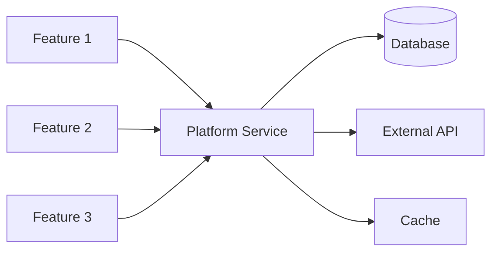
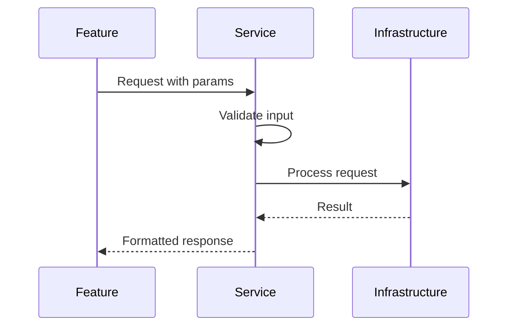

# Platform Service: [Service Name] - AI Context

*This document provides context for AI assistants working with this platform service. Platform services are shared components used by multiple features.*

## Service Overview
Brief description of what this platform service provides and why it exists as a shared component.

## Service Status
- **Stability**: [Experimental | Stable | Deprecated]
- **Version**: [1.0.0]
- **Last Major Update**: YYYY-MM-DD

## Key Documents
- **Technical Design**: [TDD-YYYY-MM-service-name.md](./TDD-YYYY-MM-service-name.md)
- **API Reference**: [Link to API docs]
- **Migration Guide**: [If applicable]
- **Related ADRs**:
  - [ADR-001-why-this-service.md](./decisions/ADR-001-why-this-service.md)

## Architecture

### Service Architecture
<!-- Update when service structure changes -->


### Integration Flow
<!-- Show how features typically integrate -->


## Integration Guide

### How to Use This Service

#### JavaScript/TypeScript
```typescript
import { ServiceClient } from '@platform/service-name';

// Initialize
const client = new ServiceClient({
  apiKey: process.env.SERVICE_API_KEY,
  timeout: 5000
});

// Basic usage
const result = await client.operation({
  param1: 'value',
  param2: 123
});
```

#### Python
```python
from platform.services import ServiceClient

# Initialize
client = ServiceClient(
    api_key=os.environ['SERVICE_API_KEY'],
    timeout=5
)

# Basic usage
result = client.operation(
    param1='value',
    param2=123
)
```

### Configuration Required
```yaml
# In feature's config
platform:
  service_name:
    enabled: true
    api_key: ${SERVICE_API_KEY}
    endpoint: ${SERVICE_ENDPOINT}
    timeout: 5000
    retry_attempts: 3
```

## Common Integration Patterns

### Pattern: Authentication Integration
```typescript
// How to integrate with auth service
import { withAuth } from '@platform/auth';

export const protectedEndpoint = withAuth(async (req, res) => {
  // req.user is now available
  const user = req.user;
  // Your feature logic here
});
```

### Pattern: Logging Integration
```typescript
// How to use platform logging
import { logger } from '@platform/logging';

logger.info('Feature action', {
  userId: user.id,
  action: 'feature.action',
  metadata: { /* context */ }
});
```

### Pattern: Error Handling
```typescript
// Handling service errors
try {
  const result = await serviceClient.operation(params);
} catch (error) {
  if (error.code === 'SERVICE_UNAVAILABLE') {
    // Fallback logic
  } else if (error.code === 'RATE_LIMITED') {
    // Retry logic
  }
  throw error;
}
```

## Service Interface

### Available Methods
```typescript
interface ServiceClient {
  // Core operations
  operation1(params: Operation1Params): Promise<Operation1Result>;
  operation2(params: Operation2Params): Promise<Operation2Result>;
  
  // Utility methods
  healthCheck(): Promise<HealthStatus>;
  getMetrics(): Promise<ServiceMetrics>;
}
```

### Error Codes
| Code | Description | How to Handle |
|------|-------------|---------------|
| `VALIDATION_ERROR` | Invalid input parameters | Check input validation |
| `RATE_LIMITED` | Too many requests | Implement backoff |
| `SERVICE_UNAVAILABLE` | Service is down | Use fallback/queue |
| `UNAUTHORIZED` | Invalid credentials | Check API key |

## Development Guidelines

### Always
- [ ] Check service health before critical operations
- [ ] Implement retry logic with exponential backoff
- [ ] Log service interactions for debugging
- [ ] Cache responses when appropriate (see caching section)
- [ ] Handle all documented error codes

### Never
- [ ] Call service in a tight loop without rate limiting
- [ ] Ignore service deprecation warnings
- [ ] Bypass service validation
- [ ] Cache user-specific or sensitive data

## Testing with This Service

### Unit Tests
```typescript
// Mock the service for unit tests
jest.mock('@platform/service-name');

const mockClient = {
  operation: jest.fn().mockResolvedValue({ success: true })
};
```

### Integration Tests
```typescript
// Use test instance of service
const testClient = new ServiceClient({
  endpoint: process.env.TEST_SERVICE_ENDPOINT,
  apiKey: 'test-key'
});
```

## Performance Considerations

### Caching Strategy
```typescript
// Cache service responses when appropriate
const cacheKey = `service:${operation}:${hashParams(params)}`;
const cached = await redis.get(cacheKey);

if (!cached) {
  const result = await serviceClient.operation(params);
  await redis.setex(cacheKey, 300, JSON.stringify(result)); // 5 min TTL
  return result;
}
```

### Rate Limits
- **Default**: 100 requests/minute per feature
- **Bulk Operations**: 10 requests/minute
- **Health Checks**: Unlimited

### SLA
- **Availability**: 99.9%
- **Response Time**: p95 < 200ms
- **Timeout**: 5 seconds default

## Features Using This Service

| Feature | Usage | Critical? |
|---------|-------|-----------|
| User Authentication | Token validation | Yes |
| Payment Processing | Fraud detection | Yes |
| Reporting | Data aggregation | No |

## Migration & Versioning

### Current Version: 1.0
- Stable API
- Full backwards compatibility

### Upcoming Changes (v2.0)
- [ ] New operation: `bulkOperation()`
- [ ] Deprecated: `oldOperation()` - use `newOperation()` instead
- [ ] Performance improvements

### Migration Path
```typescript
// v1 (current)
const result = await client.oldOperation(params);

// v2 (upcoming)
const result = await client.newOperation({
  ...params,
  newParam: 'value'
});
```

## Monitoring & Debugging

### Key Metrics
```bash
# Check service health
curl https://api.platform/service/health

# View service metrics
curl https://api.platform/service/metrics
```

### Common Issues

#### Issue: High latency
- **Check**: Service metrics dashboard
- **Common Cause**: Database connection pool exhausted
- **Solution**: Increase pool size or optimize queries

#### Issue: Authentication errors
- **Check**: API key expiration
- **Common Cause**: Rotated keys not updated
- **Solution**: Update service configuration

## Document Maintenance

### Update Triggers
- [ ] New operation added to service
- [ ] Breaking change in API
- [ ] New integration pattern discovered
- [ ] Performance characteristics change
- [ ] New feature starts using service
- [ ] Security requirements update

---
*Last Updated: YYYY-MM-DD*
*Service Version: 1.0.0*