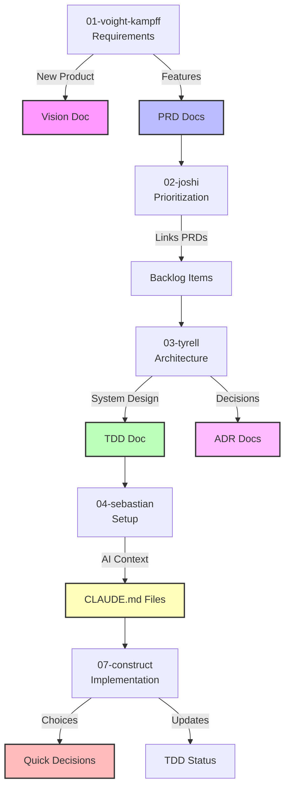

# PRIS Documentation Workflow Integration

## Overview
This guide shows how documentation flows through the PRIS development lifecycle, ensuring knowledge is captured when context is fresh.

## Documentation Flow Diagram



## Phase-by-Phase Documentation

### Phase 1: Requirements Gathering (voight-kampff)
**Creates**: Requirements document
**Triggers**:
- **Vision Document** - For new products/platforms
- **PRD Documents** - For specific features

**Example Flow**:
```bash
# Run requirements gathering
pris 01-voight-kampff

# AI detects product-level discussion
"I see you're planning a new SaaS platform. Should I create a Vision document?"
# Creates: docs/00-platform/vision/SAAS-PLATFORM-VISION.md

# AI detects feature requirements
"You've defined 3 main features. Should I create PRDs for these?"
# Creates: 
# - docs/01-core-features/auth/PRD-authentication.md
# - docs/01-core-features/billing/PRD-subscription.md
# - docs/02-business-features/reporting/PRD-analytics.md
```

### Phase 2: Prioritization (joshi)
**Links**: Backlog items to PRDs
**Validates**: High-priority items have documentation

**Example Flow**:
```bash
# Run prioritization
pris 02-joshi

# Backlog items now include:
FEAT-001: User Authentication
- PRD: docs/01-core-features/auth/PRD-authentication.md
- Priority: Must Have
- Documentation Status: ✅ Ready

FEAT-002: Analytics Dashboard  
- PRD: Not created yet
- Priority: Should Have
- Documentation Status: ⚠️ Needs PRD
```

### Phase 3: Architecture Selection (tyrell)
**Creates**: 
- **TDD** - Technical design document
- **ADRs** - Architecture decision records

**Example Flow**:
```bash
# Run architecture selection
pris 03-tyrell

# Creates and pre-populates:
# - docs/00-platform/architecture/TDD-system-architecture.md
#   (Includes selected stack, patterns, components)
#
# - docs/00-platform/decisions/ADR-001-microservices.md
# - docs/00-platform/decisions/ADR-002-postgresql.md
# - docs/00-platform/decisions/ADR-003-react-nextjs.md
```

### Phase 4: Project Setup (sebastian)
**Creates**: CLAUDE.md files for AI context

**Example Flow**:
```bash
# Run project setup
pris 04-sebastian

# Creates AI context files:
# - /CLAUDE.md (root - platform overview)
# - /services/auth/CLAUDE.md (service context)
# - /services/billing/CLAUDE.md (service context)
# - /frontend/features/dashboard/CLAUDE.md (feature context)
```

### Phase 5: Implementation (construct)
**Creates**: Quick Decision documents
**Updates**: TDD implementation status

**Example Flow**:
```bash
# During implementation
pris 07-construct --ticket FEAT-001

# AI makes implementation decision:
"Choosing bcrypt over argon2 for password hashing"

# Creates:
# - docs/01-core-features/auth/decisions/DECISION-20240115-password-hashing.md

# Updates TDD status:
# - Backend API: ✅ Complete
# - Frontend: 🟡 In Progress
# - Tests: ⬜ Pending
```

## Document Types and Purposes

### Strategic Documents (Long-term)
1. **Vision Document**
   - 3-5 year product strategy
   - Market positioning
   - Updated quarterly

2. **Architecture TDD**
   - System-wide technical design
   - Major component interactions
   - Updated with major changes

### Tactical Documents (Feature-specific)
1. **PRDs**
   - What we're building and why
   - User stories and acceptance criteria
   - Locked during implementation

2. **Feature TDDs**
   - How we'll build specific features
   - API contracts and data models
   - Updated during implementation

### Decision Documents (Immutable)
1. **ADRs**
   - Major architecture decisions
   - Include context and trade-offs
   - Never modified (create new ones to revise)

2. **Quick Decisions**
   - Implementation-level choices
   - Library selections, patterns
   - Captured during coding

### Context Documents (Living)
1. **CLAUDE.md**
   - AI assistant context
   - Conventions and patterns
   - Updated when patterns change

2. **Documentation Index**
   - Central registry of all docs
   - Links and status tracking
   - Continuously updated

## Best Practices

### 1. Documentation Timing
```
Requirements → Vision/PRDs (immediately)
     ↓
Architecture → TDD/ADRs (before coding)
     ↓
Setup → CLAUDE.md (with structure)
     ↓
Implementation → Quick Decisions (as you code)
```

### 2. Pre-Population Pattern
Each PRIS phase pre-populates documents with context:
- Vision: Uses problem statement, target users
- PRD: Uses requirements, user stories
- TDD: Uses architecture decisions, stack
- ADR: Uses evaluation criteria, alternatives
- CLAUDE.md: Uses patterns, conventions

### 3. Cross-Referencing
Every document should link to related docs:
```markdown
## Related Documentation
- [System Architecture](../TDD-system-architecture.md)
- [Auth PRD](../PRD-authentication.md)
- [Database Decision](../decisions/ADR-002-postgresql.md)
```

### 4. Status Tracking
Use the Documentation Index to track:
- Which features need PRDs
- TDD implementation progress
- Documentation staleness
- Missing CLAUDE.md files

## Common Scenarios

### Scenario 1: New Feature Request
1. Update requirements in voight-kampff
2. Create PRD for the feature
3. Link PRD in backlog (joshi)
4. Create feature TDD (if complex)
5. Add CLAUDE.md when building
6. Document decisions during coding

### Scenario 2: Architecture Change
1. Never modify existing ADR
2. Create new ADR explaining change
3. Update system TDD
4. Update affected CLAUDE.md files
5. Communicate change in Documentation Index

### Scenario 3: Quick Implementation Choice
1. Make the decision in code
2. Create Quick Decision doc immediately
3. Reference in CLAUDE.md if it sets a pattern
4. Update TDD status if relevant

## Anti-Patterns to Avoid

❌ **Documentation After**: Writing docs after implementation
✅ **Documentation During**: Capture while context is fresh

❌ **Modifying ADRs**: Changing decision records
✅ **New ADRs**: Create new ones that reference old

❌ **Generic CLAUDE.md**: Copy-paste context files
✅ **Specific Context**: Unique patterns for each component

❌ **Orphaned Docs**: Documentation without links
✅ **Connected Docs**: Everything cross-referenced

## Quick Reference

| PRIS Phase | Creates | Updates | Triggers |
|------------|---------|---------|----------|
| voight-kampff | Requirements | - | Vision, PRDs |
| joshi | Backlog | Doc links | PRD validation |
| tyrell | Architecture | - | TDD, ADRs |
| sebastian | Project structure | - | CLAUDE.md files |
| construct | Code | TDD status | Quick Decisions |

## Verification Checklist

Before considering a feature complete:
- [ ] PRD defines the what and why
- [ ] TDD defines the how
- [ ] ADRs capture major decisions
- [ ] Quick Decisions capture implementation choices
- [ ] CLAUDE.md provides AI context
- [ ] All docs cross-reference appropriately
- [ ] Documentation Index is current

Remember: **Documentation is not overhead - it's how we scale knowledge across time and team members.**